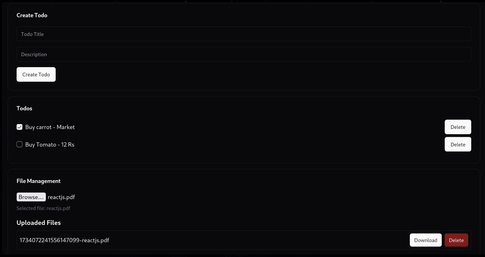

# k8s-playground
Playground for k8s

## Dummy todo app

- Tech stack : React JS + Golang + Postgres
- Download and save the file as `docker-compose.yaml`
```yaml
version: '3.8'

services:
  postgres:
    image: postgres:13
    environment:
      POSTGRES_DB: tododb
      POSTGRES_USER: todouser
      POSTGRES_PASSWORD: todopassword
    volumes:
      - postgres-data:/var/lib/postgresql/data
    # ports:
    #   - "5432:5432"

  backend:
    image: aswinbenny/todo-backend:v1
    environment:
      - DB_HOST=postgres
      - DB_USER=todouser
      - DB_PASSWORD=todopassword
      - DB_NAME=tododb
      - DB_PORT=5432
    volumes:
      - backend:/app
    depends_on:
      - postgres
    ports:
      - "8080:8080"

  frontend:
    image: aswinbenny/todo-frontend:v1
    ports:
      - "3000:80"
    depends_on:
      - backend

volumes:
  postgres-data:
  backend:
```
- Do `docker compose up` to run the app
- The app will run in `http://localhost:3000`
- The file will be uploaded to `/app/uploads` folder in the backend volume
- Backend runs in `http://localhost:8080`
